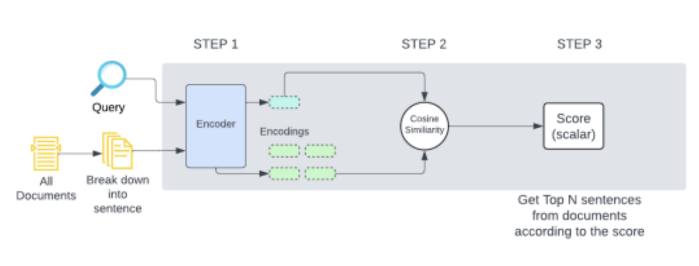

# RMIT - ANZ: ESG Automation 

This repository comprises the coursework for PGRD Data Science project, as part of the Master of Data Science syllabus at RMIT University.

## Background

We are tasked with working with the Australia and New Zealand Banking group (ANZ). They are one of the Big Four Banks in Australia with operations in retail and commercial banking. The Client Insights and solutions team at ANZ works to provide customers with insights across different operating domains to make better decisions.

This knowledge-based approach with clients leads to the need of reports for different sectors across a variety of performance metrics. The Insights team released a paper in 2022 that focused on emerging ESG trends (Environmental, Social and Governance) in the Retail Industry. ESG refers to the overall framework a company uses to assess their impact on the environment and society at large and looks at the different methods they have adopted to improve their practices.
 
The current process consists of exhaustive and time-consuming manual interpretation of reports from each corporation. The interpreted data is then collated into a sheet where the common themes are identified. Each corporation’s performance on each metric for that year is then recorded. An analyst then works to aggregate and consolidate the data before extracting valuable insights.

## Aim

The goal of this project is to transition to AI driven approaches by gathering and evaluating the ESG data of the retail industry and streamline the process for client insights and solution team. This will allow the CIS team to focus more on the important insights gained from the automation.
 
Our team will be focusing on automating the step where CIS team manually goes through the reports and will help them find the recurring themes and goals associated with the selected ESG category in the form of excel.

## Proposed Solution



## Project Structure

```text
.
|-- Images
|   `-- ProposedSolution.png
|-- POC_Analysis.ipynb                                      # Proof of Concept (T5Encoder Similarity Scorer).
|-- README.md
|-- Resources
|   `-- ANZ_RMIT_Automating_ESG_Analysis.pptm
|-- SampleReports                                           # Sample Reports.
|   |-- 2023_Coles_Report.pdf
|   `-- 2023_KMD_Report.pdf
`-- Sentence_Parser_Analysis.ipynb                          # Sentence Parser options and analysis.
```
